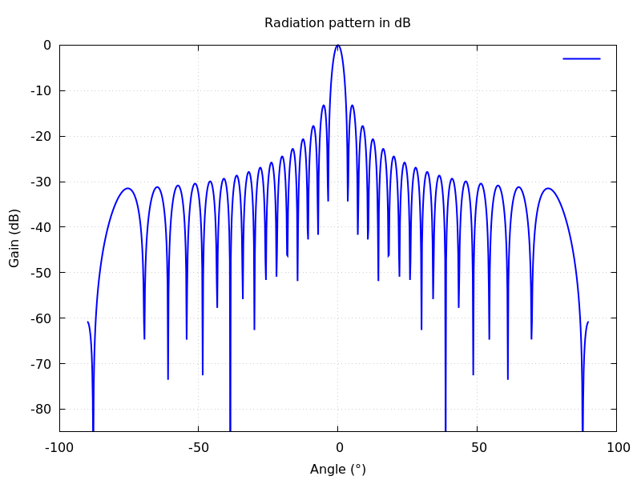

# Radiation Pattern Simulation using Far-Field Approximation

## Overview
This program calculates the **radiation pattern** of a linear antenna array using the **far-field approximation**. It evaluates the power gain in dB as a function of the observation angle \( \theta \) and visualizes the results using **Gnuplot**.

## Features
- Computes the power distribution based on **far-field approximation**.
- Supports user-defined parameters such as **element count**, **spacing**, **frequency**, and **phase shift**.
- Outputs data in a format that can be plotted using **Gnuplot**.

## Dependencies
To run this program, ensure you have:
- A C++ compiler (e.g., `g++` or `clang++`)
- Gnuplot installed (`sudo apt install gnuplot` on Linux)

## Compilation
To compile the program, use the following command:
```bash
 g++ -o farfield_simulation farfield_simulation.cpp -O3 -std=c++11
```

## Usage
Run the program with the following arguments:
```bash
 ./farfield_simulation <N> <d> <frequency> <Delta_Phi>
```
where:
- `<N>`: Number of antenna elements
- `<d>`: Spacing between elements (meters)
- `<frequency>`: Frequency of operation (Hz)
- `<Delta_Phi>`: Phase shift applied to the elements (radians)

### Example
To simulate a **40-element** array with **0.1m spacing**, operating at **1.2 GHz**, and a phase shift of **π/4**:
```bash
 ./farfield_simulation 40 0.1 1.2e9 0.785
```

## Output
- The program generates a **data file** (`data_cartesian.dat`) containing the computed power values.
- It creates a **Gnuplot script** (`cartesian_plot.gnu`) for visualization.
- The final **radiation pattern** is stored as `cartesian_plot.png`.

## Generated Plot
The resulting plot represents the **power gain (dB) vs. angle (°)**:



## Notes
- The far-field approximation is valid for distances much greater than the array size.
- The model assumes **ideal** antenna elements without mutual coupling.
